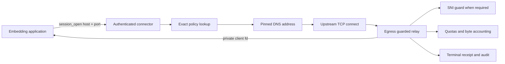
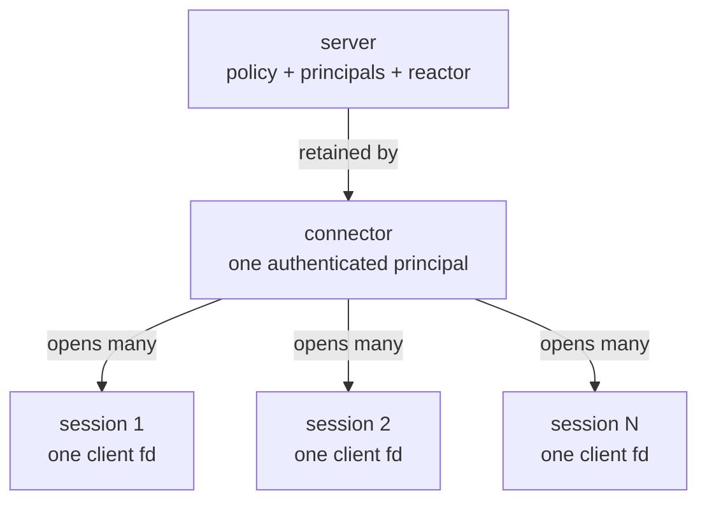
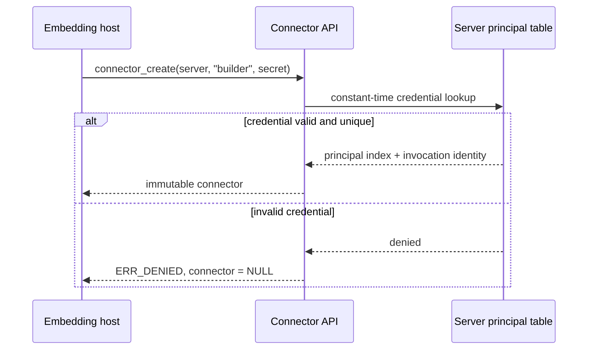
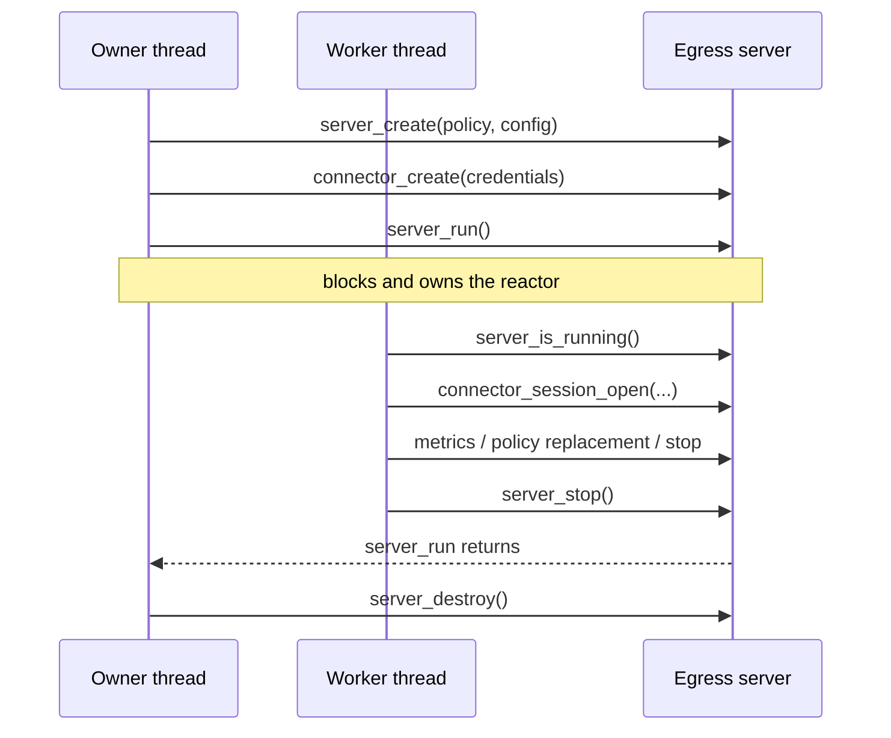
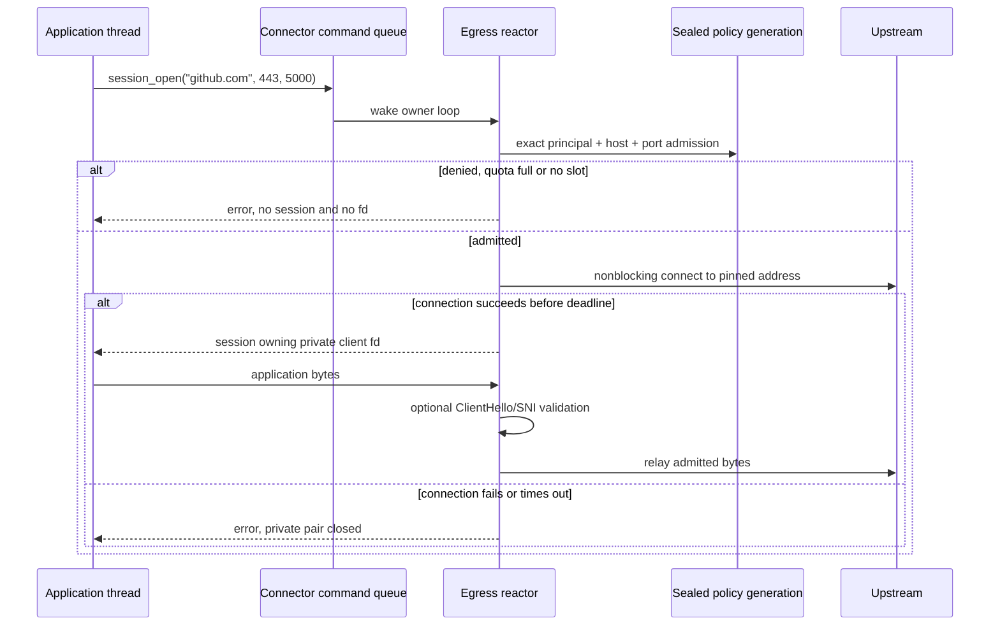
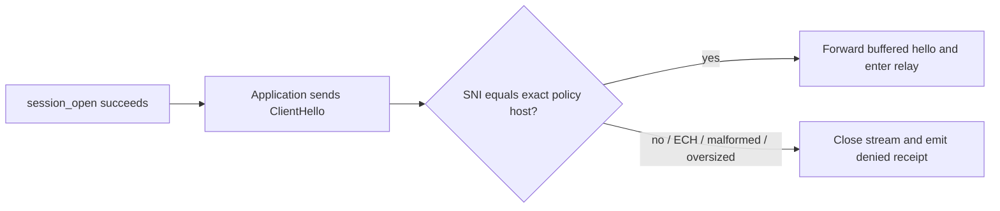
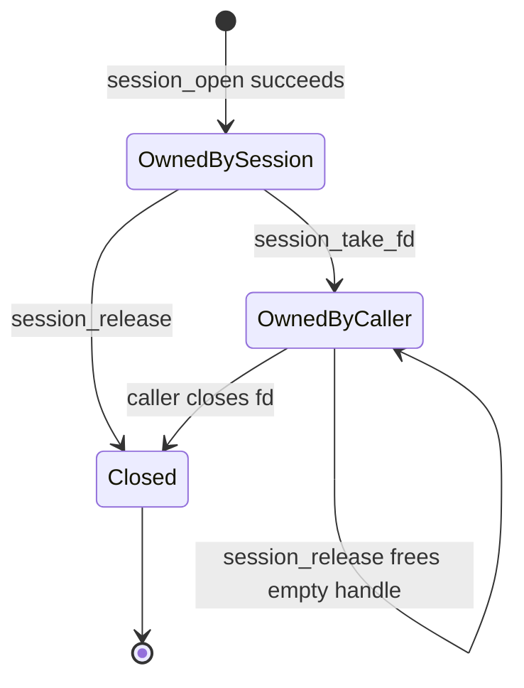
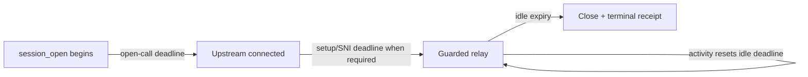
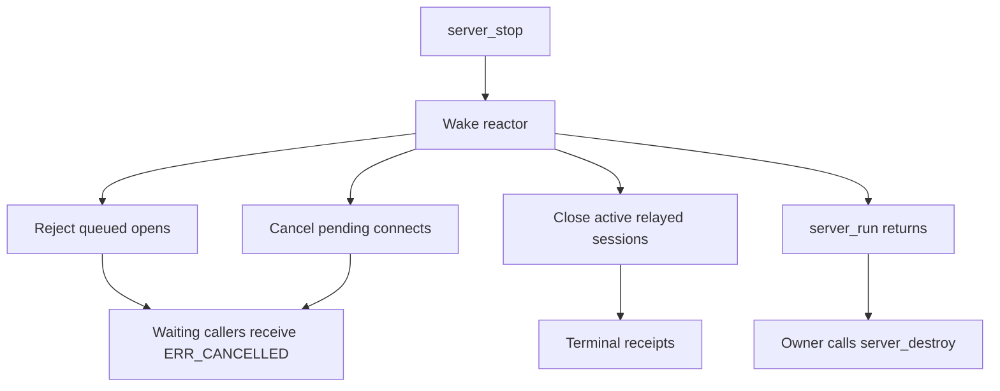
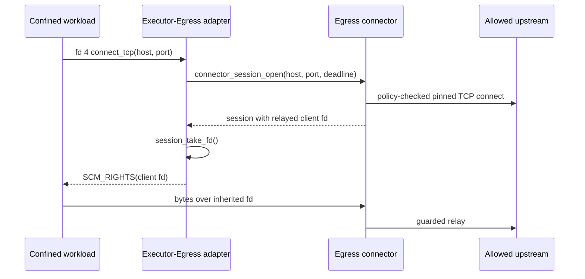

# Native connector API

The native connector is the C API for an embedding process that wants an
ordinary connected byte stream without speaking HTTP proxy or SOCKS5. It is
not a second network engine: it enters the same Egress policy, DNS pinning,
relay, quota, metrics and receipt path as the standard proxy protocols.

This guide covers the API introduced in Egress 0.7.0. A complete compilable
consumer is available in [`examples/native_connector.c`](../examples/native_connector.c).

## The essential idea

The descriptor returned to the application is one end of a private local TCP
connection. Egress owns the other end and relays it to the approved upstream
destination. The upstream socket is never handed to the application.



The security rule is:

> A native session changes how a destination is requested, not how it is
> governed. Every admitted byte still crosses Egress.

A direct handoff of the upstream socket would make later SNI validation, byte
quotas, half-close observation and terminal receipts impossible.

## The three handles



| Handle | Meaning | Threading | Release operation |
| --- | --- | --- | --- |
| `maelys_egress_server_t` | One policy engine, principal namespace and relay reactor | `run` owns one thread; documented controls are cross-thread | `server_destroy` after `server_run` returns |
| `maelys_egress_connector_t` | One successfully authenticated principal bound to a server | Immutable, retained, and usable for concurrent opens | `connector_release` |
| `maelys_egress_session_t` | The application side of one relayed stream | One application owner unless externally synchronized | `session_release` |

All public types are opaque. Egress ABI 2 exposes neither their layout nor a
`pthread` or Maelys System type.

## 1. Configure policy and principals

The destination must exist in the sealed policy before a session can open:

```c
maelys_egress_policy_create(&policy, &error);
maelys_egress_policy_allow_tcp(policy, "github.com", 443, 0, &error);
maelys_egress_policy_require_tls_sni(policy, "github.com", 443, &error);
maelys_egress_policy_seal(policy, &error);
```

`policy_seal` resolves the hostname and pins its accepted addresses. A later
session asks for the canonical policy identity (`"github.com"`, port `443`),
not an arbitrary IP chosen by the caller.

Configure at least one principal. For a single embedder:

```c
maelys_egress_config_set_authentication(
    config, "worker", "a-long-random-secret", &error);
```

For several independently identified workloads:

```c
maelys_egress_config_add_principal(
    config, "builder", builder_secret, "build-2026-0042", &error);
maelys_egress_config_add_principal(
    config, "reviewer", reviewer_secret, "review-2026-0017", &error);

maelys_egress_config_set_principal_quota(
    config, "builder", 4, UINT64_C(104857600), &error);
```

The quota permits four active admitted streams and 100 MiB observed per
stream. A zero quota value means unlimited.

An in-process-only deployment should disable the HTTP/SOCKS listener:

```c
maelys_egress_config_set_native_only(config, 1, &error);
```

The reactor, policy, native connector, receipts and optional admin listener
remain active, but Egress binds no proxy TCP port and creates no proxy Unix
socket. Calling `config_set_listen` or `config_set_listen_unix` later selects a
listener again. This is an embedding mode, not an authentication bypass.

## 2. Authenticate a connector

```c
maelys_egress_connector_t *connector = NULL;

maelys_egress_result_t result = maelys_egress_server_connector_create(
    server, "builder", builder_secret, &connector, &error);
```

Authentication occurs once, during connector creation:



The connector retains a reference to the server control object, the matched
principal identity and the non-secret invocation identifier. It does **not**
retain the supplied credential.

The principal never derives from the hostname, process name, environment or
caller metadata. Receipts include the matched principal and invocation ID,
never its secret. The caller remains responsible for acquiring the secret from
a secret store, avoiding logs and wiping its own mutable copy when practical.

Principal configuration belongs to the server configuration copy. Replacing a
sealed network policy does not rotate credentials; recreate the server to
install a different principal set.

## 3. Start the server

Connector creation may occur after `server_create`, but session admission needs
the owner thread to be running. `server_is_running` provides a thread-safe
readiness predicate for an embedder that creates its own server thread.



Receipt and attestor callbacks execute synchronously on the owner thread. They
must not re-enter a server control operation.

## 4. Open a relayed session

```c
maelys_egress_session_t *session = NULL;

result = maelys_egress_connector_session_open(
    connector,
    "github.com", /* canonical policy hostname */
    443,
    5000,         /* finite relative timeout in milliseconds */
    &session,
    &error);
```

The destination hostname must already be canonical. DNS names use lowercase
ASCII labels without an empty label or trailing dot. `"GITHUB.COM"` is rejected
rather than silently changing the requested policy identity.



On success, `session_fd(session)` returns a borrowed blocking, close-on-exec TCP
descriptor. Normal `send`, `recv`, `poll` and `shutdown` operations apply. Egress
retains the peer and continues enforcing the stream. The application should
use `MSG_NOSIGNAL` where available, or its normal SIGPIPE policy, because Egress
may close the stream after denial or shutdown.

### SNI happens after `session_open`

`session_open` returns after policy admission and the upstream TCP connection.
When `require_tls_sni` applies, Egress cannot validate the hostname until the
application sends its TLS ClientHello. Egress buffers those first bytes and
forwards nothing upstream until the exact SNI matches.



A successful open proves policy admission and TCP connectivity. For an
SNI-guarded destination, the terminal receipt records whether application-layer
identity was subsequently verified.

## 5. Descriptor ownership

Borrow the descriptor while the session owns it:

```c
int borrowed_fd = maelys_egress_session_fd(session);
```

`session_release(session)` closes that descriptor. Do not independently close
the borrowed descriptor and then release a still-owning session.

Transfer ownership when another component must own or pass the descriptor:

```c
int owned_fd = -1;
result = maelys_egress_session_take_fd(session, &owned_fd, &error);
maelys_egress_session_release(session); /* empty; does not close owned_fd */
```



After transfer, Egress still owns and relays the peer; only application-side
descriptor ownership changes.

## 6. Deadlines and cancellation

Three different clocks are involved:

| Deadline | Configured by | Bounds | On expiry |
| --- | --- | --- | --- |
| Open-call deadline | `timeout_ms` passed to `session_open` | How long the caller waits for admission and upstream connection | `ERR_TIMEOUT`, no fd, pending open cancelled |
| Server setup deadline | `handshake_timeout_ms` in `config_set_limits` | Owner-thread setup, upstream connect and optional pending SNI guard | Connection closed with a terminal result |
| Relay idle deadline | `idle_timeout_ms` in `config_set_limits` | Time with no observed stream activity | Stream closed and receipt emitted |

All internal comparisons use monotonic time, so wall-clock changes do not alter
them.



The open timeout is not installed as `SO_RCVTIMEO` or `SO_SNDTIMEO` on the
returned descriptor. After success, the application chooses its own operation
deadlines while Egress independently enforces the configured idle deadline.

A timeout or cancellation never returns a partially admitted descriptor. The
server loop closes both sides of the private pair and discards a late upstream
completion.

## 7. Concurrency and shutdown

An immutable connector is reference-counted and supports concurrent opens.
Each call has its own command, condition, deadline and private stream.
Admissions enter the single owner-thread reactor; relays progress through its
normal readiness loop.

Retain a shared connector for as long as opener threads can start operations.
Releasing the final reference concurrently with a thread that has not already
retained it is a caller error.



Releasing a connector does not close already returned sessions. Stopping the
server does. A connector may outlive `server_destroy` because it retains the
small control object, but a new open then returns `ERR_STATE`; it cannot
resurrect the data plane.

## 8. Results and diagnostics

Every fallible call returns `maelys_egress_result_t`. Release a populated
`out_error` with `maelys_egress_error_free`.

| Result | Typical connector meaning |
| --- | --- |
| `MAELYS_EGRESS_OK` | Connector or session created |
| `MAELYS_EGRESS_ERR_ARGUMENT` | Missing output, zero port/timeout, or non-canonical host |
| `MAELYS_EGRESS_ERR_DENIED` | Invalid credential, absent destination, address rule, SNI or quota denial |
| `MAELYS_EGRESS_ERR_STATE` | Server unavailable, no slot, or descriptor already transferred |
| `MAELYS_EGRESS_ERR_TIMEOUT` | Caller open deadline expired |
| `MAELYS_EGRESS_ERR_CANCELLED` | Server stopped or admission cancelled |
| `MAELYS_EGRESS_ERR_IO` | Private stream, reactor or upstream failure |
| `MAELYS_EGRESS_ERR_MEMORY` | Allocation failed before ownership returned |

Failed `connector_create` leaves `out_connector` as `NULL`. Failed
`session_open` leaves `out_session` as `NULL`; no descriptor is transferred.

## 9. Receipts and observability

Native sessions produce receipts with `MAELYS_EGRESS_PROTOCOL_CONNECTOR`. They
use the same getters and durable audit path as HTTP and SOCKS:

```text
principal + invocation_id
exact host + port
policy digest + generation
start time + duration
bytes from client + bytes to client
result + SNI verification status
optional attestor identity + signature
```

The receipt is emitted when the connection closes, not when `session_open`
returns. Byte counts, duration, SNI status and final result therefore describe
observed execution rather than admission intent. Receipt pointers and strings
are borrowed only during the synchronous callback.

## 10. Executor and fd 4 boundary

Egress deliberately has no `fd4`, `SCM_RIGHTS`, Sandbox or Executor symbol. A
separate adapter translates the wire request into this generic API:



The adapter must pass the relayed client descriptor, never replace it with a
direct upstream connection. That keeps policy, SNI, quotas and receipts
identical across native, HTTP and SOCKS frontends.

## Security boundary summary

The connector guarantees exact credential-to-principal binding, exact sealed
host/port admission, pinned-address connection, no fd after a failed decision,
and continued relay enforcement with configured SNI, quotas and receipts.

It does not prevent the embedding process from opening unrelated sockets,
inject a descriptor into another process, provide a Sandbox/Executor policy,
terminate upstream TLS, inspect encrypted application content, or install
application read/write timeouts. Those remain host-confinement, adapter,
TLS-inspection or application-I/O responsibilities.
